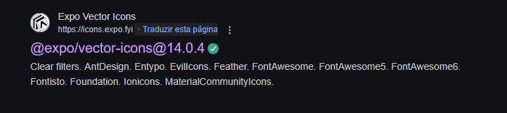

# Criando o Header (Cabeçalho) do Index

## Passo 01: No arquivo "index.tsx" vamos começar apagando o compente "Text"

O componente **Text** era apenas para exemplificar o como funciona o desenvolvimento.

* Apague o componente **Text** e deixe somente a **View** vazia.

**index.tsx**
```js
// importando componentes de dentro do react native
import { Text, View } from "react-native"

// Importando o arquivo de Styles do componente
import { styles } from "./styles"

// Export default é o metodo usado para dizer ao ExporRouter que esse componente é uma Rota.
export default function Index() {
    return (
    
        // View é um componente que recebe estilização, semelhante a Div do HTML
        <View style={styles.container} >
        </View>
    )
}
```
## Passo 02: Crie uma outra "View" dentro da "View" principal.

Para criar o **"Header"** vamos adicionar um nova **View** dentro **View** principal

* Crie uma **View** dentro da **View principal**
* Adicione um **style** e defina o nome da estilização como **header**.

**index.tsx**
```js
// importando componentes de dentro do react native
import { View } from "react-native"

// Importando o arquivo de Styles do componente
import { styles } from "./styles"

// Export default é o metodo usado para dizer ao ExporRouter que esse componente é uma Rota.
export default function Index() {
    return (
    
        // View é um componente que recebe estilização, semelhante a Div do HTML
        <View style={styles.container}>
            <View style={styles.header}>
                
            </View>
        </View>
    )
}
```
* Ao finalizar perceberá que o VSCode informará mostrar que á um erro no codigo criado.
* Mas não é um erro, é apenas o VScode reclamando que o style que foi adicionado para a nova via não existe. **Ainda**. 

## Passo 03: Proximo passo é adicionar um componnte **"Image"** que receberá a logo do aplicatico.

Agora que criamos a **View** que será o **Header** vamos começar a montar ele. 

### Etapa 01: Crie uma nova pasta chamada "assets" dentro da pasta "src"

* Crie a pasta **assets**
* Va na pasta assets que baixamos do **Drive**, acesse a pasta **src** e arraste a imagem **"Logo.png"** para dentro da pasta **assets** que criamos.

### Etapa 02: Em nosso codigo, vamos importar o componente Image de dentro do React-Native e depois adiciona-lo ao codigo.

* Importe o componente **Image** de dentro do **React-native**
* Adicione ele dentro da **View** que criamos para o **Header**. 

**index.js**

```js
// importando componentes de dentro do react native
import { View, Image } from "react-native"

// Importando o arquivo de Styles do componente
import { styles } from "./styles"

// Export default é o metodo usado para dizer ao ExporRouter que esse componente é uma Rota.
export default function Index() {
    return (
    
        // View é um componente que recebe estilização, semelhante a Div do HTML
        <View style={styles.container}>
            <View style={styles.header}>
                <Image source={require("@/assets/logo.png")} />
            </View>
        </View>
    )
}
```
* Apos adicionar a Imagem, você perceberá que a imagem do nosso Header ficou centralizada.
* Esse comportamente é devido aos estilos adicionados na **View** container.
* Acesse o arquivo **"styles.ts"** do **"index.tsx"** e remova de dentro do objeto de estilos **"container"** as propriedades: **justifyContent** e o **alignItems**

**styles.ts**
```js
// importando componentes de dentro do react native
import { StyleSheet } from "react-native"

// importando as cores de dentro da pasta styles
import { colors } from "@/styles/colors"

// Usando o export antes da constante, nos permitimos que as estilizações sejam acessadas pelo componente.
export const styles = StyleSheet.create({

    container: {
        flex: 1,
    },

    title: {
        color: colors.green[900],
        fontSize: 22,
    }
})
```
### Etapa 03: Adicione também no componente "Image" um "style" nome de "logo" para estilização.

* Adicione a propriedade **style** e defina o nome da estilizaçãod e **"Logo"**
* Observe que também aparecerá um erro, pois esta estilização ainda não existe.

**index.tsx**
```js
// importando componentes de dentro do react native
import { View, Image } from "react-native"

// Importando o arquivo de Styles do componente
import { styles } from "./styles"

// Export default é o metodo usado para dizer ao ExporRouter que esse componente é uma Rota.
export default function Index() {
    return (
    
        // View é um componente que recebe estilização, semelhante a Div do HTML
        <View style={styles.container}>
            <View style={styles.header}>
                <Image source={require("@/assets/logo.png")} style={styles.logo} />
            </View>
        </View>
    )
}
```

## Passo 04: Proximo passo é criar as as estilizações "header" e "logo" que ja adicionamos nos componentes antecipadamente.

* Acesse o arquivo **styles.ts** na pasta do componente **index.tsx**

### Etapa 01: Vamos adicionar/criar aos objetos de estilização "header" e "logo".

* Crie um novo objeto de estilização dentro "StyleSheet.create" chamado **"header"**.
* Crie um novo objeto de estilização dentro "StyleSheet.create" chamado **"logo"** também.

**styles.ts**
```js
// importando componentes de dentro do react native
import { StyleSheet } from "react-native"

// importando as cores de dentro da pasta styles
import { colors } from "@/styles/colors"

// Usando o export antes da constante, nos permitimos que as estilizações sejam acessadas pelo componente.
export const styles = StyleSheet.create({

    container: {
        flex: 1,
    },

    title: {
        color: colors.green[900],
        fontSize: 22,
    },

    header: {}, // <---- novo

    logo: {}, // <---- novo
})
```
* Observe que apos criar os objetos de estilização os erros no arquivo **index.tsx** sumiram pois agora os objetos ja existem.

### Etapa 02: Vamos adicionar as propriedade de estilização nos objetos "Logo" e "Header".

* Para estilizar nossa logo, será necessario adicionar as seguintes propriedades:

```js
// importando componentes de dentro do react native
import { StyleSheet } from "react-native"

// importando as cores de dentro da pasta styles
import { colors } from "@/styles/colors"

// Usando o export antes da constante, nos permitimos que as estilizações sejam acessadas pelo componente.
export const styles = StyleSheet.create({

    container: {
        flex: 1,
        
        paddingTop: 22, // <---- novo
    },

    title: {
        color: colors.green[900],
        fontSize: 22,
    },

    header: {
        borderWidth: 1,  // <---- novo
        borderTopColor: 'red',  // <---- novo
        borderBottomColor: 'red',  // <---- novo
        borderLeftColor: 'red',  // <---- novo
        borderRightColor: 'red',  // <---- novo

        paddingHorizontal: 24,  // <---- novo
    },

    logo: {
        height: 32,  // <---- novo
        width: 38,  // <---- novo
    },
})
```

## Passo 05: Proximo passo é criar o botão da funcionalidade "adicionar um novo link" da aplicação

Para isso será necessario usar uma biblioteca de icones do **"expos/vector-icons"** para que seja usado um icone para o botão.

### Etapa 01: Faça uma nova importanção e importe de dentro do "expo/vector-icons" a biblioteca de icones "MaterialIcons"

* Importe a biblioteca **"MaterialIcons"** de dentro do *"expo/vector-icons"** no arquivo **index.tsx**

**index.tsx**
```js
// importando componentes de dentro do react native
import { View, Image } from "react-native"
import { MaterialIcons } from "@expo/vector-icons"  // <---- novo

// Importando o arquivo de Styles do componente
import { styles } from "./styles"

// Export default é o metodo usado para dizer ao ExporRouter que esse componente é uma Rota.
export default function Index() {
    return (
    
        // View é um componente que recebe estilização, semelhante a Div do HTML
        <View style={styles.container}>
            <View style={styles.header}>
                <Image source={require("@/assets/logo.png")} style={styles.logo} />
            </View>
        </View>
    )
}
```

* Para saber quais icones bibliotecas tem dentro do expo/vector-icons, basta pesquisar no google: **expo vector icons**
* E entrar no seguinte site:



### Etapa 02: Apos a importação da biblioteca, vamos adicionar o icone que precisamos usando ela.

* Adicione a biblioteca ao codigo no **"index.tsx"** como se fosse um componente.
* Adicione a **"propriedade"** **"name"** ao componente e informe o nome do simbolo que desejamos, no caso é **"add"**
* Adicione a **"propriedade"** **"size"** ao componente e informe o tamanho do simbolo que desejamos, no caso será **"32"**
* Adicione também a **"propriedade"** **"color"** ao componente e informe também a cor do simbolo que desejamos, nesse caso será usado as cores que estão no nosso arquivo de **colors.ts** que ja adicionamos em nosso projeto.
* Para adicionar acessar o arquivo de **"colors.ts"** devemos primeiro fazer a sua importação no nosso arquivo **"index.tsx"**
* Apos realizar a importação, adicione dentro da **"propriedade"** **"color"** do componente de Icone **"MaterialIcon"** a cor **"green[300]"**

**index.tsx**
```js
// importando componentes de dentro do react native
import { View, Image } from "react-native"
import { MaterialIcons } from "@expo/vector-icons"

// Importando o arquivo de Styles do componente
import { styles } from "./styles"
import { colors } from "@/styles/colors"  // <---- novo

// Export default é o metodo usado para dizer ao ExporRouter que esse componente é uma Rota.
export default function Index() {
    return (
    
        // View é um componente que recebe estilização, semelhante a Div do HTML
        <View style={styles.container}>
            <View style={styles.header}>
                <Image source={require("@/assets/logo.png")} style={styles.logo} />

                <MaterialIcons name="add" size={32} color={colors.green[300]} />  // <---- novo
            </View>
        </View>
    )
}
```

## Passo 06: Após criar e adicionar nosso botão de "adicionar links" vamos terminar de estilizar o "Header"

Ao adicionar o botão **"adicionar links"** vimos que eles não estão organizados da forma correta dentro do header.
Nosso proximo passo é estilizar o Header e organizar essas coisas.

### Etapa 01: Acesse novamente o arquivo "styles.ts" na pasta do componente "index"

* Adicione as seguintes propriedades no objeto de estilização **"header"**

**styles.ts**
```js
// importando componentes de dentro do react native
import { StyleSheet } from "react-native"

// importando as cores de dentro da pasta styles
import { colors } from "@/styles/colors"

// Usando o export antes da constante, nos permitimos que as estilizações sejam acessadas pelo componente.
export const styles = StyleSheet.create({

    container: {
        flex: 1,
        
        paddingTop: 22,
    },

    title: {
        color: colors.green[900],
        fontSize: 22,
    },

    header: {
        borderWidth: 1,
        borderTopColor: 'red',
        borderBottomColor: 'red',
        borderLeftColor: 'red',
        borderRightColor: 'red',

        paddingHorizontal: 24,
        
        width: "100%",   // <---- novo
        flexDirection: "row",   // <---- novo
        justifyContent: "space-between",   // <---- novo
        alignItems: 'center',   // <---- novo
        marginBottom: 32,   // <---- novo
    },

    logo: {
        height: 32,
        width: 38,
    },
})
```

* Agora ja conseguimos vizualizar o header como deve ser.

### Etapa 02: Adicionando a efeito visual de "Touch" ou "Clique" no nosso botão.

* Volte no arquivo **"index.tsx"** e adicione na importação do react-native a utilização do componente **"TouchableOpacity"**
* Apos realizar a importação do componente basta adiciona-lo ou chama-lo junto com os **componentes que estão dentro da View "header"**
* Apos adiciona-lo, mova ou recorte o componente do Icone, **MaterialIcons** para dentro do componente **"TouchableOpacity"** 

**index.tsx**
```js
// importando componentes de dentro do react native
import { View, Image, TouchableOpacity } from "react-native"
import { MaterialIcons } from "@expo/vector-icons"

// Importando o arquivo de Styles do componente
import { styles } from "./styles"
import { colors } from "@/styles/colors"

// Export default é o metodo usado para dizer ao ExporRouter que esse componente é uma Rota.
export default function Index() {
    return (
    
        // View é um componente que recebe estilização, semelhante a Div do HTML
        <View style={styles.container}>
            <View style={styles.header}>
                <Image source={require("@/assets/logo.png")} style={styles.logo} />

                <TouchableOpacity>  
                    <MaterialIcons name="add" size={32} color={colors.green[300]} /> 
                </TouchableOpacity> 
            </View>
        </View>
    )
}
```

# Até a próxima aula!
